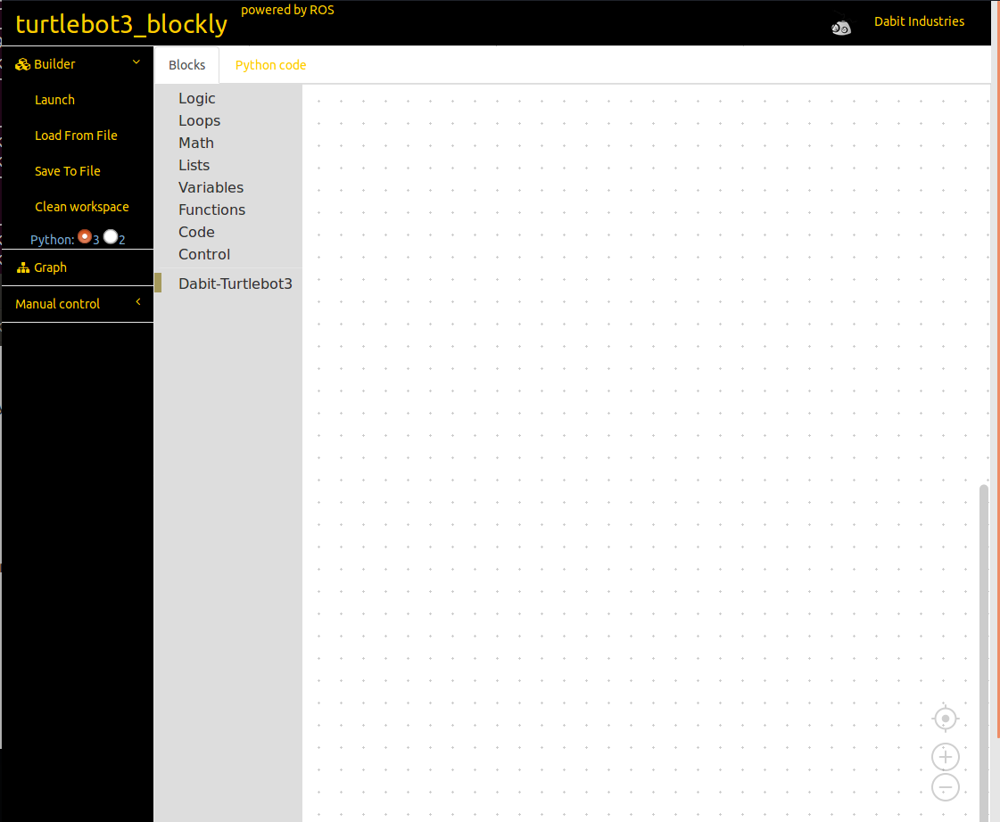

# turtlebot3_blockly
This is a modified version of the [erlerobot/robot_blockly](https://github.com/erlerobot/robot_blockly.git) repo. 
You can now control TurtleBot3 using Blockly - drag and drop software developed by Google.




### Installation

```
mkdir -p ~/blockly_ws/src
cd ~/blockly_ws/src
git clone https://github.com/dabit-industries/turtlebot3_blockly
cd turtlebot3_blockly/frontend/
git submodule add https://github.com/dabit-industries/ace-builds.git ace-builds
git submodule init
git submodule update
git submodule add https://github.com/dabit-industries/blockly.git blockly
git submodule init
git submodule update
cd ~/blockly_ws/
catkin_make_isolated -j2 --pkg turtlebot3_blockly --install
```

or you may try this

```
mkdir -p ~/blockly_ws/src
cd ~/blockly_ws/src
git clone --recurse-submodules https://github.com/dabit-industries/turtlebot3_blockly

cd ~/blockly_ws
catkin_make_isolated -j2 --pkg turtlebot3_blockly --install
```

### Launch

```
cd ~/blockly_ws
source devel_isolated/setup.bash
roslaunch turtlebot3_blockly turtlebot3_blockly.launch
```

### Bugs/Issues


### Documentation
- [TurtleBot3 Blockly]()
- [TurtleBot3 setup](http://turtlebot3.robotis.com/en/latest/hardware.html)
- [ROS Wiki](http://www.ros.org) 
